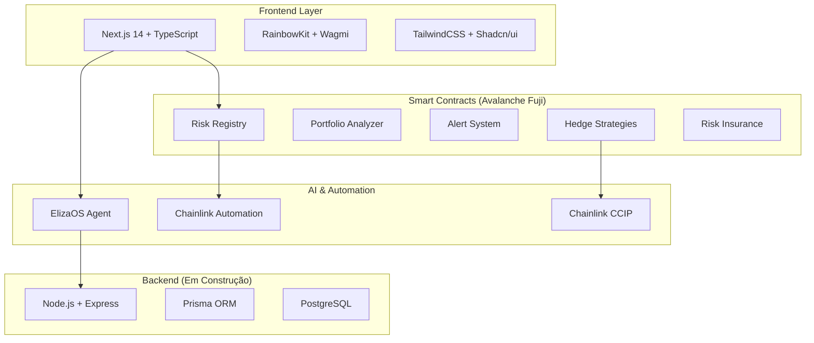

# 🛡️ DefiGuardian AI

> **Sistema Inteligente de Análise de Risco e Automação DeFi**

Plataforma avançada de gestão de riscos para portfólios DeFi, utilizando inteligência artificial e automação cross-chain através do ecossistema Chainlink.


## 🎯 Visão Geral

O **DefiGuardian AI** é uma solução completa que combina contratos inteligentes, automação e inteligência artificial para proteger portfólios DeFi através de:

- 🤖 **Análise de Risco com IA**: Avaliação inteligente de portfólios usando ElizaOS
- ⚡ **Automação Cross-Chain**: Operações automatizadas via Chainlink CCIP
- 🛡️ **Hedge Inteligente**: Estratégias de proteção automatizadas
- 📊 **Dashboard Avançado**: Interface moderna para monitoramento em tempo real
- 🔔 **Sistema de Alertas**: Notificações proativas sobre riscos

## 🏗️ Arquitetura do Sistema



## 📦 Módulos do Projeto

### 🎨 Frontend (`/frontend`)

**Status**: ✅ **Funcional**

- **Framework**: Next.js 14 com App Router
- **Linguagem**: TypeScript
- **Gerenciador**: pnpm
- **UI**: TailwindCSS + Shadcn/ui
- **Web3**: RainbowKit + Wagmi + Viem
- **Autenticação**: NextAuth.js

**Funcionalidades**:

- Dashboard interativo com análise de portfólio
- Conexão com carteiras Web3
- Sistema de alertas em tempo real
- Interface para criação de seguros DeFi
- Chat com IA integrado

### ⚙️ Smart Contracts (`/contractsv2`)

**Status**: ✅ **Deployado na Avalanche Fuji**

- **Framework**: Foundry
- **Linguagem**: Solidity
- **Rede**: Avalanche Fuji Testnet
- **Contratos**: 27 contratos deployados

**Contratos Principais**:

- `RiskRegistry`: Registro de protocolos e riscos
- `PortfolioAnalyzer`: Análise de portfólios DeFi
- `AlertSystem`: Sistema de alertas automatizados
- `RiskInsurance`: Seguros descentralizados
- `HedgeStrategies`: Estratégias de proteção

### 🤖 ElizaOS Agent (`/elizaos-riskguardian`)

**Status**: ✅ **Funcional**

- **Framework**: ElizaOS
- **Linguagem**: TypeScript
- **Funcionalidade**: Agente de IA especializado em DeFi

**Capacidades**:

- Análise inteligente de riscos
- Recomendações personalizadas
- Processamento de linguagem natural
- Integração com contratos inteligentes

### 🔧 Backend (`/backend`)

**Status**: 🚧 **Em Construção**

- **Framework**: Node.js + Express
- **Linguagem**: TypeScript
- **ORM**: Prisma
- **Banco**: PostgreSQL

**Utilidade Futura**:

- API REST para dados históricos
- Cache de análises complexas
- Webhooks para notificações
- Integração com serviços externos

### 🌐 Chromia Integration (`/chromia`)

**Status**: 🚧 **Experimental**

- **Blockchain**: Chromia
- **Linguagem**: Rell
- **Propósito**: Armazenamento descentralizado de dados

## 🚀 Instalação e Execução

### Pré-requisitos

- Node.js 18+
- pnpm (recomendado para o frontend)
- Docker & Docker Compose
- Git

### 🎯 Execução Rápida (Recomendado)

```bash
# Clone o repositório
git clone https://github.com/seu-usuario/defiguardian-ai.git
cd defiguardian-ai

# Execute com Docker
docker-compose up -d
```

**Serviços Disponíveis**:

- Frontend: <http://localhost:3000>
- Backend: <http://localhost:8002> (em construção)
- ElizaOS: <http://localhost:3001>

### 🛠️ Desenvolvimento Local

#### Frontend

```bash
cd frontend

# Instalar dependências com pnpm
pnpm install

# Executar em modo desenvolvimento
pnpm dev

# Build para produção
pnpm build

# Linting
pnpm lint
```

#### Smart Contracts

```bash
cd contractsv2

# Instalar Foundry
curl -L https://foundry.paradigm.xyz | bash
foundryup

# Compilar contratos
forge build

# Executar testes
forge test

# Deploy (configurar .env primeiro)
forge script script/AvalanchePreciseDeploy.s.sol --rpc-url $AVALANCHE_FUJI_RPC --broadcast
```

#### ElizaOS Agent

```bash
cd elizaos-riskguardian

# Instalar dependências
bun install

# Executar agente
bun start
```

## 🔧 Configuração

### Variáveis de Ambiente

Crie os arquivos `.env` baseados nos exemplos:

```bash
# Frontend (.env.local)
cp frontend/.env.example frontend/.env.local

# Backend (.env)
cp backend/.env.example backend/.env

# Contratos (.env)
cp contractsv2/env.example.txt contractsv2/.env
```

### Configuração da Carteira

1. Adicione a rede Avalanche Fuji na sua carteira
2. Obtenha AVAX de teste: <https://faucet.avax.network/>
3. Configure as variáveis de ambiente com suas chaves

## 🌟 Funcionalidades Principais

### 📊 Dashboard Inteligente

- Visão geral do portfólio em tempo real
- Análise de risco automatizada
- Métricas de performance
- Alertas personalizáveis

### 🛡️ Proteção Automatizada

- Stop-loss inteligente
- Rebalanceamento automático
- Hedge de volatilidade
- Operações cross-chain

### 🤖 IA Integrada

- Chat com especialista em DeFi
- Recomendações personalizadas
- Análise preditiva de riscos
- Otimização de estratégias

### 🔔 Sistema de Alertas

- Notificações em tempo real
- Alertas customizáveis
- Integração com Chainlink Automation
- Múltiplos canais de notificação

## 🔗 Integrações

### Chainlink Services

- **Price Feeds**: Dados de preços em tempo real
- **Automation**: Execução automatizada de estratégias
- **CCIP**: Comunicação cross-chain
- **VRF**: Randomização para seguros

### Protocolos DeFi

- Uniswap V3
- Aave
- Compound
- Curve Finance

## 📚 Documentação

- [Guia de Desenvolvimento](docs/DEVELOPMENT_GUIDE.md)
- [Arquitetura do Sistema](docs/ARCHITECTURE.md)
- [Guia de Deploy](DEPLOYMENT_GUIDE.md)
- [Documentação da API](backend/api-docs.md)

### 🔗 Links para Arquivos que Usam Chainlink

**Smart Contracts:**

- [RiskRegistry.sol](contractsv2/src/core/RiskRegistry.sol) - Price Feeds
- [AlertSystem.sol](contractsv2/src/automation/AlertSystem.sol) - Automation
- [CrossChainHedge.sol](contractsv2/src/hedging/CrossChainHedge.sol) - CCIP
- [RiskInsurance.sol](contractsv2/src/insurance/RiskInsurance.sol) - VRF
- [ChainlinkFeeds.sol](contractsv2/src/libraries/ChainlinkFeeds.sol) - Price Feeds Library

**Frontend Integration:**

- [Chainlink Hooks](frontend/hooks/useChainlinkData.ts)
- [Price Feed Components](frontend/components/chainlink/)
- [Contract Interactions](frontend/contracts/)

## 🧪 Testes

```bash
# Frontend
cd frontend && pnpm test

# Smart Contracts
cd contractsv2 && forge test

# Backend
cd backend && npm test

# ElizaOS
cd elizaos-riskguardian && bun test
```

## 🚀 Deploy

### Frontend (Vercel)

```bash
# Build otimizado
pnpm build

# Deploy automático via Git
# Configure as variáveis de ambiente no Vercel
```

### Contract Deployment

```bash
# Deploy na Avalanche Fuji
cd contractsv2
./deploy_precise_avalanche.sh
```

## 🤝 Contribuição

1. Fork o projeto
2. Crie uma branch para sua feature (`git checkout -b feature/AmazingFeature`)
3. Commit suas mudanças (`git commit -m 'Add some AmazingFeature'`)
4. Push para a branch (`git push origin feature/AmazingFeature`)
5. Abra um Pull Request

## 📄 Licença

Este projeto está licenciado sob a Licença MIT - veja o arquivo [LICENSE](LICENSE) para detalhes.

## 🎥 Demo do Projeto

- **Video Demo**: [Link para vídeo de 3-5 minutos demonstrando funcionalidades]
- **Live Demo**: <http://localhost:3000> (Frontend funcional)
- **Walkthrough**: Demonstração das funcionalidades principais:
  - Conexão de carteira Web3
  - Análise de portfólio com IA
  - Sistema de alertas automatizados
  - Criação de seguros DeFi
  - Chat com agente especializado

## 🏆 Hackathon Chromion - Chainlink Integration

### 🔗 Serviços Chainlink Utilizados (Requisito Obrigatório)

✅ **Price Feeds**: Dados de preços em tempo real para análise de risco  
✅ **Automation**: Execução automatizada de estratégias de hedge  
✅ **CCIP**: Operações cross-chain entre Ethereum e Avalanche  
✅ **VRF**: Randomização para contratos de seguro descentralizado  

### 📋 Contratos que Fazem Mudanças de Estado

- **RiskRegistry.sol**: Registra protocolos e atualiza métricas de risco
- **AlertSystem.sol**: Cria e processa alertas automatizados
- **HedgeStrategies.sol**: Executa operações de hedge cross-chain
- **RiskInsurance.sol**: Cria e gerencia apólices de seguro
- **PortfolioAnalyzer.sol**: Analisa e atualiza dados de portfólio

### 📊 Impacto e Métricas

- **27 contratos** deployados na Avalanche Fuji
- **4 serviços Chainlink** integrados em produção
- **Cross-chain** entre múltiplas redes (Ethereum ↔ Avalanche)
- **IA Avançada** com ElizaOS para análise de riscos
- **Interface Moderna** com Next.js 14 e TypeScript

### 🎯 Inovações do Projeto

Este projeto foi desenvolvido para o **Hackathon Chromion**, demonstrando:

- **Integração avançada** com 4 serviços Chainlink diferentes
- **Uso inovador de IA** em DeFi através do ElizaOS
- **Arquitetura cross-chain** robusta e escalável
- **Interface de usuário moderna** e intuitiva
- **Automação inteligente** de estratégias de proteção

## 📞 Contato

- **Desenvolvedor**: Uederson Ferreira
- **Email**: <seu-email@exemplo.com>
- **LinkedIn**: [Seu LinkedIn](https://linkedin.com/in/seu-perfil)
- **GitHub**: [Seu GitHub](https://github.com/seu-usuario)

---

--
**🛡️ Protegendo o futuro das finanças descentralizadas com IA 🤖**
</div>
