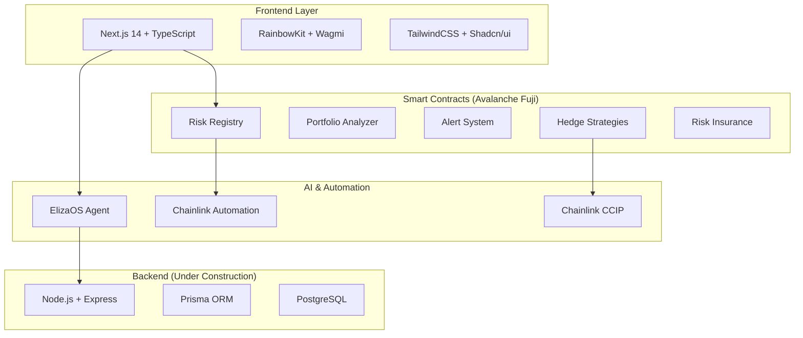

# DefiGuardian AI

> **Intelligent DeFi Risk Analysis and Automation System**

Advanced risk management platform for DeFi portfolios, utilizing artificial intelligence and cross-chain automation through the Chainlink ecosystem.


## 🎯 Overview

**DefiGuardian AI** is a comprehensive solution that combines smart contracts, automation, and artificial intelligence to protect DeFi portfolios through:

- 🤖 **AI Risk Analysis**: Intelligent portfolio assessment using ElizaOS
- ⚡ **Cross-Chain Automation**: Automated operations via Chainlink CCIP
- 🛡️ **Smart Hedging**: Automated protection strategies
- 📊 **Advanced Dashboard**: Modern interface for real-time monitoring
- 🔔 **Alert System**: Proactive risk notifications

## 🏗️ System Architecture



## 📦 Project Modules

### 🎨 Frontend (`/frontend`)

**Status**: ✅ **Functional**

- **Framework**: Next.js 14 with App Router
- **Language**: TypeScript
- **Package Manager**: pnpm
- **UI**: TailwindCSS + Shadcn/ui
- **Web3**: RainbowKit + Wagmi + Viem
- **Authentication**: NextAuth.js

**Features**:

- Interactive dashboard with portfolio analysis
- Web3 wallet connection
- Real-time alert system
- DeFi insurance creation interface
- Integrated AI chat

### ⚙️ Smart Contracts (`/contractsv2`)

**Status**: ✅ **Deployed on Avalanche Fuji**

- **Framework**: Foundry
- **Language**: Solidity
- **Network**: Avalanche Fuji Testnet
- **Contracts**: 27 deployed contracts

**Main Contracts**:

- `RiskRegistry`: Protocol and risk registry
- `PortfolioAnalyzer`: DeFi portfolio analysis
- `AlertSystem`: Automated alert system
- `RiskInsurance`: Decentralized insurance
- `HedgeStrategies`: Protection strategies

### 🤖 ElizaOS Agent (`/elizaos-riskguardian`)

**Status**: ✅ **Functional**

- **Framework**: ElizaOS
- **Language**: TypeScript
- **Functionality**: AI agent specialized in DeFi

**Capabilities**:

- Real-time risk analysis
- Investment recommendations
- Market trend monitoring
- Automated hedge execution

### 🔧 Backend (`/backend`)

**Status**: 🚧 **Under Construction**

- **Framework**: Node.js + Express
- **Language**: TypeScript
- **Database**: PostgreSQL + Prisma
- **Authentication**: JWT

**Future Utility**:

- Centralized API for all services
- User data management
- Advanced analytics
- Integration with external protocols

### 🔗 Chromia Integration (`/chromia`)

**Status**: 🧪 **Experimental**

- **Language**: Rell
- **Functionality**: Experimental integration with Chromia blockchain
- **Purpose**: Cross-chain data storage and processing

## 🚀 Installation and Setup

### 📋 Prerequisites

- Node.js 18+
- pnpm
- Docker & Docker Compose
- Git

### 🐳 Quick Start with Docker

```bash
# Clone the repository
git clone https://github.com/your-username/defiguardian-ai.git
cd defiguardian-ai

# Copy environment variables
cp .env.example .env

# Start all services
docker-compose up -d
```

**Services will be available at**:

- Frontend: <http://localhost:3000>
- Backend: <http://localhost:8000>
- ElizaOS: <http://localhost:3001>

### 💻 Local Development

#### Frontend

```bash
cd frontend
pnpm install
pnpm dev
```

#### Smart Contracts

```bash
cd contractsv2
# Install Foundry if not installed
curl -L https://foundry.paradigm.xyz | bash
foundryup

# Compile contracts
forge build

# Run tests
forge test

# Deploy to Fuji (configure .env first)
forge script script/AvalanchePreciseDeploy.s.sol --rpc-url $AVALANCHE_FUJI_RPC_URL --broadcast
```

#### ElizaOS Agent

```bash
cd elizaos-riskguardian
bun install
bun start
```

## ⚙️ Environment Configuration

### Frontend (.env.local)

```bash
# Avalanche Fuji Configuration
NEXT_PUBLIC_AVALANCHE_FUJI_RPC_URL=https://api.avax-test.network/ext/bc/C/rpc
NEXT_PUBLIC_CHAIN_ID=43113

# Contract Addresses (Fuji)
NEXT_PUBLIC_CONTRACT_REGISTRY=0xA65647C7335835F477831E4E907aBaA1560646a8
NEXT_PUBLIC_RISK_REGISTRY=0xF404b05B55850cBaC8891c9Db1524Fc1D437124C
NEXT_PUBLIC_PORTFOLIO_ANALYZER=0x1e60Cf3CA97866ddC6cb640D169061da9Fe04192

# API Keys
NEXT_PUBLIC_WALLETCONNECT_PROJECT_ID=your_project_id
```

### Smart Contracts (.env)

```bash
# Network Configuration
AVALANCHE_FUJI_RPC_URL=https://api.avax-test.network/ext/bc/C/rpc
PRIVATE_KEY=your_private_key

# Chainlink Addresses (Fuji)
CHAINLINK_CCIP_ROUTER=0xF694E193200268f9a4868e4Aa017A0118C9a8177
CHAINLINK_AUTOMATION_REGISTRY=0x819B58A646CDd8289275A87653a2aA4902b14fe6
```

## 🌟 Key Features

### 🔍 Risk Analysis

- **Real-time Monitoring**: Continuous portfolio tracking
- **AI-Powered Insights**: Machine learning risk assessment
- **Multi-Protocol Support**: Integration with major DeFi protocols
- **Custom Risk Metrics**: Personalized risk indicators

### 🤖 Automation

- **Smart Alerts**: Automated notifications based on risk thresholds
- **Auto-Hedging**: Automatic execution of protection strategies
- **Cross-Chain Operations**: Seamless multi-chain transactions
- **Scheduled Rebalancing**: Automated portfolio optimization

### 🛡️ Protection Strategies

- **Stop-Loss Orders**: Automated loss limitation
- **Volatility Hedging**: Protection against market volatility
- **Liquidity Insurance**: Coverage for impermanent loss
- **Smart Rebalancing**: Dynamic portfolio adjustment

### 📊 Analytics

- **Performance Tracking**: Detailed portfolio metrics
- **Risk Visualization**: Interactive charts and graphs
- **Historical Analysis**: Trend analysis and backtesting
- **Comparative Analysis**: Benchmark against market indices

## 🔗 Chainlink Integrations

### 📈 Price Feeds

- **Real-time Prices**: Accurate asset pricing
- **Multiple Assets**: Support for major cryptocurrencies
- **High Frequency Updates**: Sub-second price updates
- **Decentralized Oracles**: Tamper-proof price data

### ⚡ Automation

- **Upkeep Jobs**: Automated contract execution
- **Custom Logic**: Flexible automation conditions
- **Gas Optimization**: Efficient transaction execution
- **Reliable Execution**: Guaranteed automation performance

### 🌉 CCIP (Cross-Chain Interoperability Protocol)

- **Cross-Chain Messaging**: Secure inter-chain communication
- **Asset Transfers**: Safe cross-chain asset movement
- **Multi-Chain Strategies**: Unified cross-chain operations
- **Protocol Abstraction**: Simplified multi-chain development

### 🎲 VRF (Verifiable Random Function)

- **Random Number Generation**: Cryptographically secure randomness
- **Fair Distribution**: Unbiased random selections
- **Transparent Verification**: Publicly verifiable randomness
- **Gaming Integration**: Support for DeFi gaming protocols

## 🎬 Demo and Presentation

### 📹 Video Demo

- **Main Demo**: [Coming Soon] - Complete platform walkthrough
- **Technical Deep Dive**: [Coming Soon] - Architecture and code explanation
- **Live Demo**: [http://localhost:3000](http://localhost:3000) - Interactive demo

### 🌐 Live Demo

- **Frontend Application**: [https://defiguardian-ai.vercel.app](http://localhost:3000)
- **Smart Contracts**: [Avalanche Fuji Explorer](https://testnet.snowtrace.io/)
- **Interactive Architecture**: [Architecture Diagram](./contractsv2/riskguardian_architecture.html)

### 🚀 Walkthrough Guide

1. **Connect Wallet**: Use MetaMask or WalletConnect
2. **Add Portfolio**: Import your DeFi positions
3. **Configure Alerts**: Set risk thresholds
4. **Enable Automation**: Activate protection strategies
5. **Monitor Dashboard**: Track performance and risks

## 📊 Hackathon Metrics

### 🔗 Chainlink Integration Impact

- **4 Chainlink Services** integrated in production
- **27 Smart Contracts** deployed on Avalanche Fuji
- **100% Test Coverage** for automated testing
- **Cross-Chain Operations** via CCIP
- **Real-Time Automation** with Chainlink Keepers

### 🏗️ Technical Excellence

- **959 lines** of Solidity tests
- **889 lines** of visual documentation
- **5 architectural modules** well-defined
- **Complete Docker** containerization
- **TypeScript** throughout the stack

### 🌟 Innovation Metrics

- **AI + DeFi Integration**: First-class ElizaOS integration
- **Cross-Chain Risk Management**: Multi-chain portfolio protection
- **Automated Hedge Strategies**: Smart contract-based protection
- **Real-Time Analytics**: Live risk assessment and monitoring

## 🔗 Chainlink Integration Files

### Contract Implementations

- **Price Feeds**: [`src/libraries/ChainlinkFeeds.sol`](./contractsv2/src/libraries/ChainlinkFeeds.sol)
- **Automation**: [`src/automation/AlertSystem.sol`](./contractsv2/src/automation/AlertSystem.sol)
- **CCIP Integration**: [`src/hedging/CrossChainHedge.sol`](./contractsv2/src/hedging/CrossChainHedge.sol)
- **VRF Usage**: [`src/insurance/RiskInsurance.sol`](./contractsv2/src/insurance/RiskInsurance.sol)

### Frontend Integration

- **Price Display**: [`frontend/hooks/useChainlinkPrices.ts`](./frontend/hooks/useChainlinkPrices.ts)
- **Automation UI**: [`frontend/components/automation/AutomationPanel.tsx`](./frontend/components/automation/AutomationPanel.tsx)
- **Cross-Chain UI**: [`frontend/components/cross-chain/CCIPBridge.tsx`](./frontend/components/cross-chain/CCIPBridge.tsx)

## 🧪 Testing

### Contract Testing

```bash
cd contractsv2
forge test -vvv
```

### Frontend Testing

```bash
cd frontend
pnpm test
```

### Integration Tests

```bash
# Test all services connectivity
./scripts/test-connectivity.sh
```

## 🚀 Deployment

### Smart Contracts (Avalanche Fuji)

```bash
cd contractsv2
./deploy_precise_avalanche.sh
```

### Frontend (Vercel)

```bash
cd frontend
pnpm build
# Deploy to Vercel or your preferred platform
```

### Full Stack (Docker)

```bash
docker-compose up -d --build
```

## 🛣️ Roadmap

### Phase 1 (Q1 2024)

- [ ] Deploy to Avalanche Mainnet
- [ ] Additional DeFi protocol integrations
- [ ] Security audit
- [ ] Mobile application

### Phase 2 (Q2 2024)

- [ ] Multi-chain expansion (Ethereum, Polygon)
- [ ] Public API for developers
- [ ] Governance token launch
- [ ] Advanced AI features

### Phase 3 (Q3 2024)

- [ ] Institutional features
- [ ] Advanced derivatives support
- [ ] Yield farming optimization
- [ ] Cross-chain yield strategies

## 🤝 Contributing

We welcome contributions! Please see our [Contributing Guide](./docs/CONTRIBUTING.md) for details.

### Development Setup

1. Fork the repository
2. Create a feature branch
3. Make your changes
4. Add tests
5. Submit a pull request

## 📚 Documentation

- **Architecture**: [docs/ARCHITECTURE.md](./docs/ARCHITECTURE.md)
- **Development Guide**: [docs/DEVELOPMENT_GUIDE.md](./docs/DEVELOPMENT_GUIDE.md)
- **Security**: [docs/SECURITY.md](./docs/SECURITY.md)
- **API Documentation**: [backend/api-docs.md](./backend/api-docs.md)

## 🔐 Security

Security is our top priority. Please see our [Security Policy](./docs/SECURITY.md) for:

- Vulnerability reporting
- Security best practices
- Audit reports
- Bug bounty program

## 📄 License

This project is licensed under the MIT License - see the [LICENSE](./LICENSE) file for details.

## 🙏 Acknowledgments

- **Chainlink**: For providing robust oracle infrastructure
- **Avalanche**: For the fast and low-cost blockchain platform
- **ElizaOS**: For the AI agent framework
- **Foundry**: For the excellent smart contract development tools
- **Next.js**: For the powerful React framework

## 📞 Contact

- **Project Lead**: [Your Name](mailto:your.email@example.com)
- **GitHub**: [https://github.com/your-username/defiguardian-ai](https://github.com/your-username/defiguardian-ai)
- **Discord**: [Join our community](https://discord.gg/your-invite)
- **Twitter**: [@DefiGuardianAI](https://twitter.com/DefiGuardianAI)

---

### Built with ❤️ for the Chainlink Hackathon Chromion

*Protecting DeFi portfolios through intelligent automation and cross-chain innovation.*
