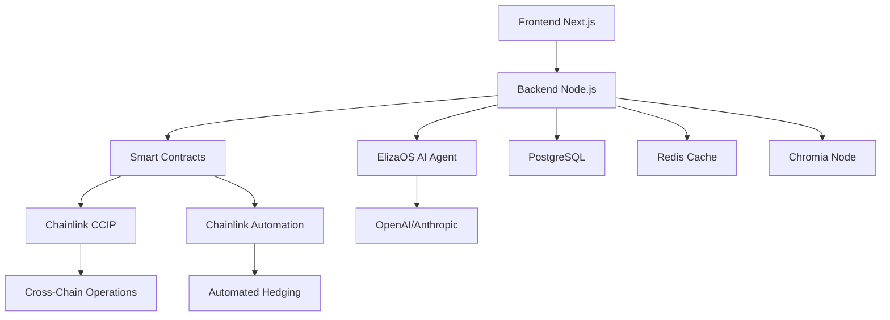
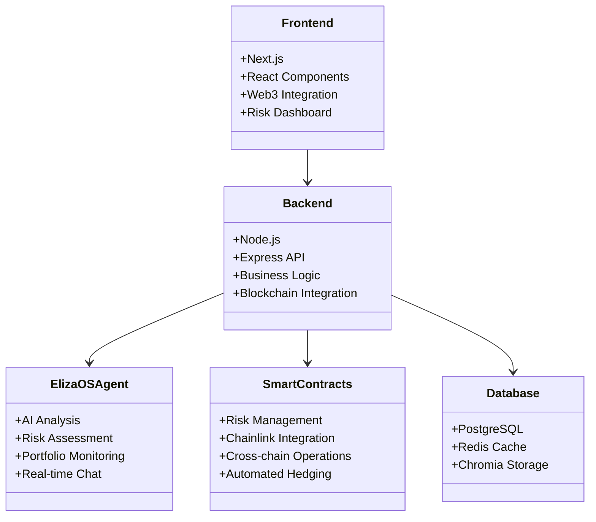
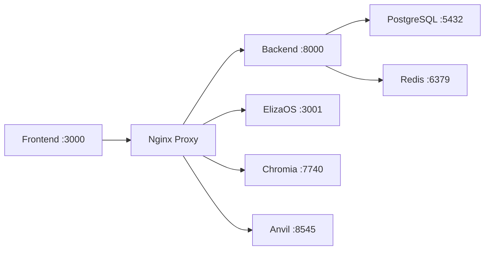
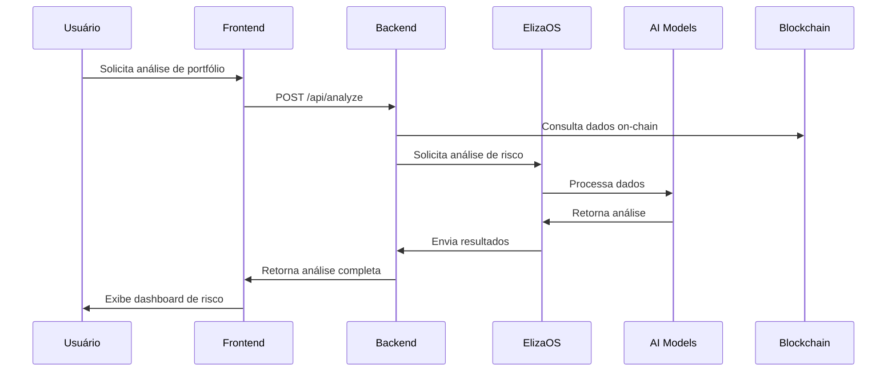
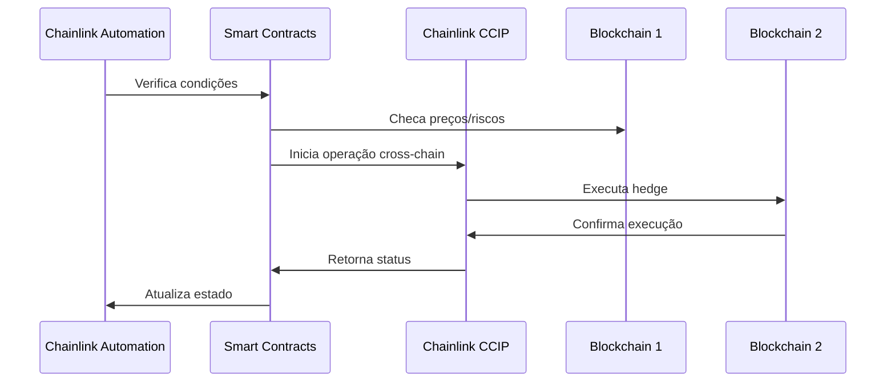
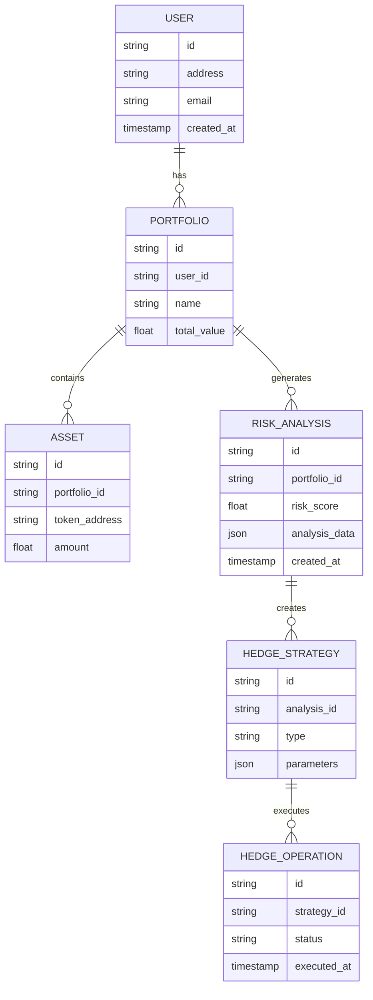
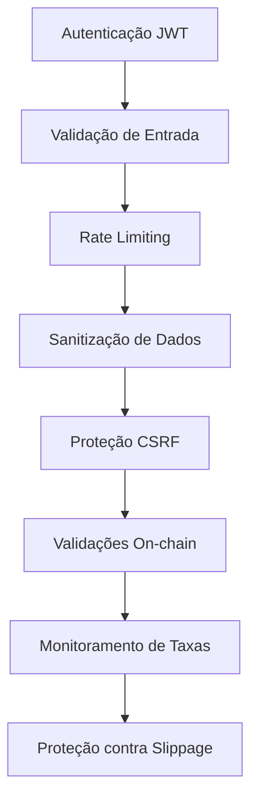
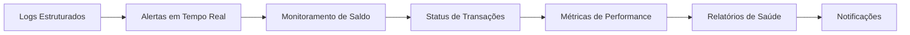

# 🛡️ RiskGuardian AI - Documentação Técnica

## 📋 Visão Geral do Projeto

O RiskGuardian AI é uma plataforma avançada de análise e gerenciamento de riscos para portfólios DeFi, combinando blockchain, inteligência artificial e automação para proteger investimentos através de operações de hedge automatizadas entre diferentes blockchains.

### Principais Funcionalidades
- Análise de risco em tempo real de portfólios DeFi
- Automação de hedge cross-chain via Chainlink CCIP
- Sistema de alertas e monitoramento
- Interface intuitiva para gestão de riscos
- Integração com múltiplos protocolos DeFi



## 🏗️ Arquitetura do Sistema

### Componentes Principais



### Portas e Serviços



## 🔄 Fluxos de Operação

### Fluxo de Análise de Risco



### Fluxo de Hedge Automatizado



## 🗄️ Estrutura de Dados

### Modelo de Dados Principal



## 🛠️ Componentes Técnicos

### Frontend (Next.js)
- **Porta**: 3000
- **Tecnologias**: React, TypeScript, Web3.js
- **Principais Componentes**:
  - Dashboard de Risco
  - Interface de Portfólio
  - Painel de Controle de Hedge
  - Chat com IA

### Backend (Node.js)
- **Porta**: 8000
- **Tecnologias**: Express, TypeScript, Ethers.js
- **Funcionalidades**:
  - API RESTful
  - Integração Blockchain
  - Gerenciamento de Usuários
  - Processamento de Dados

### ElizaOS Agent (IA)
- **Porta**: 3001
- **Tecnologias**: Node.js, OpenAI/Anthropic
- **Capacidades**:
  - Análise de Risco
  - Processamento de Linguagem Natural
  - Recomendações de Hedge
  - Chat em Tempo Real

### Smart Contracts (Solidity)
- **Redes**: Ethereum (Sepolia), Avalanche (Fuji)
- **Frameworks**: Hardhat, Chainlink
- **Contratos**:
  - RiskRegistry
  - HedgeAutomation
  - CrossChainHedge
  - AlertSystem

## 🔒 Segurança e Monitoramento

### Camadas de Segurança



### Sistema de Monitoramento



## 🚀 Ambiente de Desenvolvimento

### Setup do Ambiente
1. **Pré-requisitos**:
   - Docker e Docker Compose
   - Node.js 18+
   - Git

2. **Instalação**:
```bash
git clone https://github.com/seu-usuario/riskguardian-ai.git
cd riskguardian-ai
cp .env.example .env
./scripts/setup.sh
```

3. **Iniciar Desenvolvimento**:
```bash
./scripts/start-dev.sh
```

### Estrutura de Diretórios
```
riskguardian-ai/
├── frontend/          # Interface do usuário
├── backend/           # API e lógica de negócios
├── elizaos-agent/     # Agente de IA
├── contracts/         # Smart contracts
├── chromia/           # Nó Chromia
├── scripts/          # Scripts de automação
└── docs/             # Documentação
```

## 📊 Métricas e Monitoramento

### Endpoints de Saúde
- Frontend: `http://localhost:3000/health`
- Backend: `http://localhost:8000/health`
- ElizaOS: `http://localhost:3001/health`
- Chromia: `http://localhost:7740/health`

### Logs e Diagnósticos
```bash
# Visualizar logs
docker-compose logs -f [serviço]

# Status dos containers
docker-compose ps

# Métricas de recursos
docker stats
```

## 🔧 Configuração

### Variáveis de Ambiente Principais
```env
# AI
OPENAI_API_KEY=sk-xxx
ANTHROPIC_API_KEY=sk-ant-xxx
OPENROUTER_API_KEY=sk-or-xxx

# Blockchain
CHAINLINK_API_KEY=xxx
ETHERSCAN_API_KEY=xxx
ALCHEMY_API_KEY=xxx

# Segurança
JWT_SECRET=xxx
```

## 📝 Documentação Adicional

- [Guia de Contribuição](CONTRIBUTING.md)
- [Documentação da API](api-docs.md)
- [Smart Contracts](SMART_CONTRACTS.md)
- [Guia de Segurança](SECURITY.md)

## 🤝 Suporte e Contribuição

Para suporte técnico ou dúvidas:
- Email: support@riskguardian.ai
- GitHub Issues: [Criar Issue](https://github.com/seu-usuario/riskguardian-ai/issues)

Para contribuir:
1. Fork o repositório
2. Crie uma branch para sua feature
3. Faça commit das mudanças
4. Push para a branch
5. Abra um Pull Request

## 📄 Licença

Este projeto está licenciado sob a Licença MIT - veja o arquivo [LICENSE](LICENSE) para detalhes. 